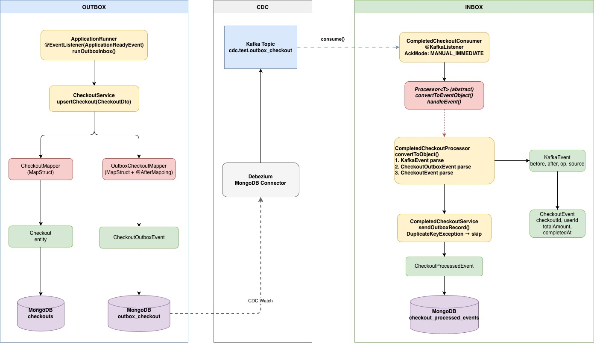

## Design Patterns — Spring Boot

#### A hands-on reference project implementing common design patterns with Spring Boot.

#### No neeed to run separate docker-compose file cuz test containers (included debezium kafka connecter) would be fine. Just run and debug to see what is happening.

#### Patterns:

- Strategy
- Decorator
- Factory
- Outbox
- Inbox  (Outbox and inbox pattern in the same directory and working with the same structure.)
  
  

## OutBox Inbox Example - LLD Map

